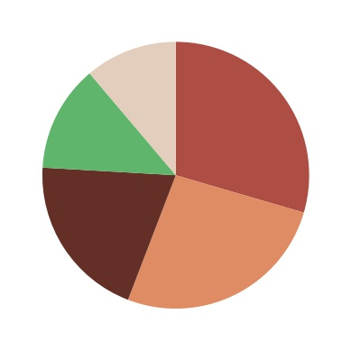
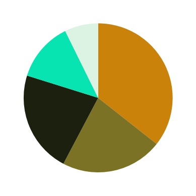
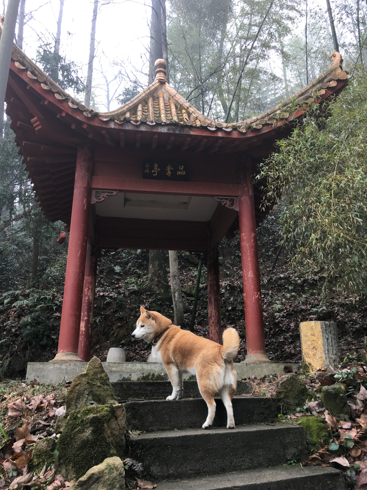
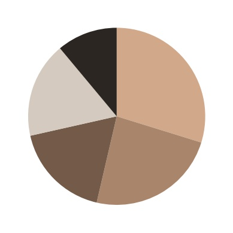

# instance-dominant-colors
Extract dominant colors from an instance segment.

Instance segmentstion method: [Mask R-CNN](https://github.com/matterport/Mask_RCNN) with its provided trained COCO model.

Extract dominant colors method: [k-means clustering](https://scikit-learn.org/stable/modules/generated/sklearn.cluster.KMeans.html)

# Example
pizza
<p align="center">
    
    
    <br>Photo by mahyar motebassem on Unsplash</br>
    
</p>

traffic light
<p align="center">
    
    
    <br>Photo by Aleksandr Kotlyar on Unsplash</br>
    
</p>

dog
<p align="center">
    
    
    
</p>

# Installation
Clone this repository

```
$ cd instance-dominant-colors
$ pip3 install -r requirements.txt
```

# Usage
```python
from instance2color import Instance2Color

inst = Instance2Color(image_file='sample_img/pizza.jpg', class_name='pizza', num_of_color=5)

print(inst.dominant_colors()) # RGBs and percentages
# [([174, 77, 68], 29.46), ([223, 139, 100], 26.41), ([99, 46, 38], 19.95), ([95, 181, 107], 12.9), ([227, 205, 189], 11.29)]
inst.visualize_pie(output_file='sample_img/pizza_pie_chart.jpg')
# visualize pie chart
inst.visualize_instance(output_file='sample_img/pizza_inst.jpg')
# visualize instance segmentation
```


