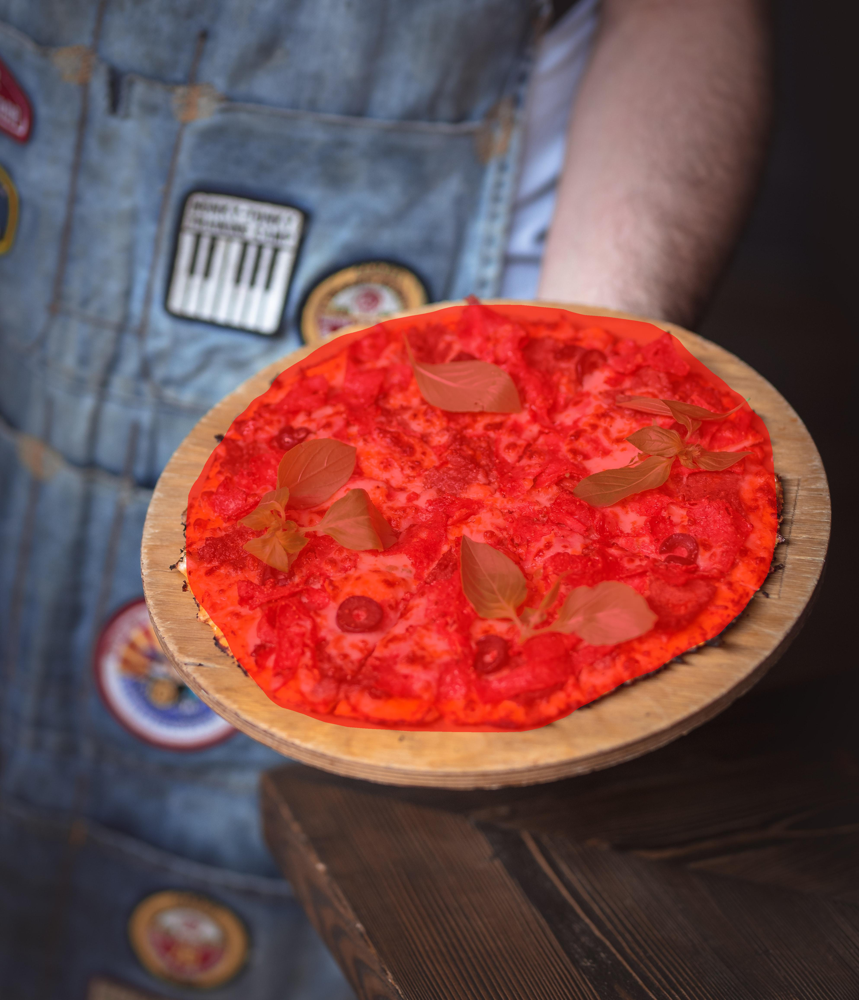
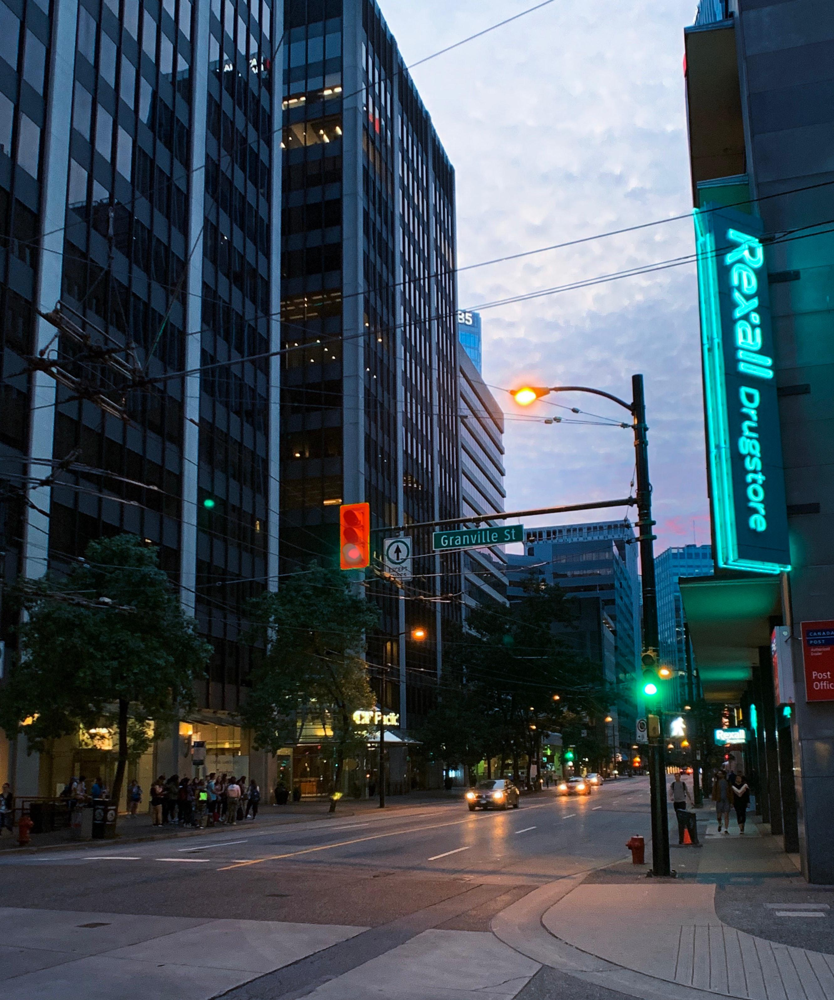
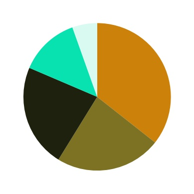

# instance-dominant-colors
Extract dominant colors from an instance segment.

Instance segmentstion method: [Mask R-CNN](https://github.com/matterport/Mask_RCNN) with its provided trained COCO model.

Extract dominant colors method: [k-means clustering](https://scikit-learn.org/stable/modules/generated/sklearn.cluster.KMeans.html)

# Example
pizza
<p align="center">
    
    
    <br>Photo by mahyar motebassem on Unsplash</br>
    
</p>

traffic light
<p align="center">
    
    
    <br>Photo by Aleksandr Kotlyar on Unsplash</br>
    
</p>

dog
<p align="center">
    
    
    
</p>

# Installation
Clone this repository

```
$ cd instance-dominant-colors
$ pip3 install -r requirements.txt
```

# Usage
```python
from instance2color import Instance2Color

inst = Instance2Color(image_file='sample_img/pizza.jpg', class_name='pizza', num_of_color=5)
# available class names are:
# class_names = ['BG', 'person', 'bicycle', 'car', 'motorcycle', 'airplane',
#                 'bus', 'train', 'truck', 'boat', 'traffic light',
#                 'fire hydrant', 'stop sign', 'parking meter', 'bench', 'bird',
#                 'cat', 'dog', 'horse', 'sheep', 'cow', 'elephant', 'bear',
#                 'zebra', 'giraffe', 'backpack', 'umbrella', 'handbag', 'tie',
#                 'suitcase', 'frisbee', 'skis', 'snowboard', 'sports ball',
#                 'kite', 'baseball bat', 'baseball glove', 'skateboard',
#                 'surfboard', 'tennis racket', 'bottle', 'wine glass', 'cup',
#                 'fork', 'knife', 'spoon', 'bowl', 'banana', 'apple',
#                 'sandwich', 'orange', 'broccoli', 'carrot', 'hot dog', 'pizza',
#                 'donut', 'cake', 'chair', 'couch', 'potted plant', 'bed',
#                 'dining table', 'toilet', 'tv', 'laptop', 'mouse', 'remote',
#                 'keyboard', 'cell phone', 'microwave', 'oven', 'toaster',
#                 'sink', 'refrigerator', 'book', 'clock', 'vase', 'scissors',
#                 'teddy bear', 'hair drier', 'toothbrush']
# model will be downloaded if not exist

print(inst.dominant_colors()) # RGBs and percentages
# [([176, 79, 70], 30.35), ([222, 139, 101], 26.19), ([102, 51, 42], 19.43), ([97, 181, 108], 12.89), ([227, 207, 190], 11.14)]
inst.visualize_pie(output_file='sample_img/pizza_pie_chart.jpg')
# visualize pie chart
inst.visualize_instance(output_file='sample_img/pizza_inst.jpg')
# visualize instance segmentation
```


